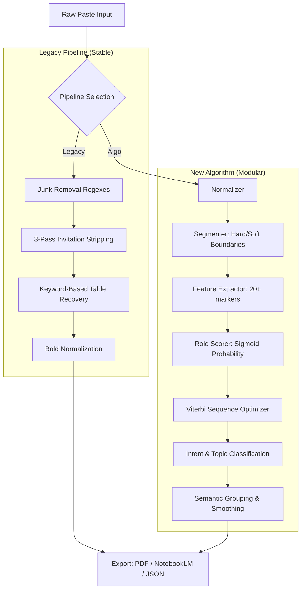

# 📊 Gemini PDF Tool — 機能実装レポート

> 最終更新: 2026-02-20

## プロジェクト概要

**gemini-pdf-tool** — Geminiチャットの対話ログをコピー＆ペーストして、PDF出力 / NotebookLM連携 / リッチプレビューを行うWebアプリ（React + TypeScript + Vite）

---

## ✅ 動作している機能

### 1. チャット入力・パース (`parseGeminiChat`)

| 項目 | 状態 | 詳細 |
|---|---|---|
| テキストエリア入力 | ✅ | Ctrl+Vで貼り付け、リアルタイム反映 |
| ユーザー/Geminiブロック分割 | ✅ | `あなたのプロンプト` / `Gemini の回答` をマーカーとして検出 |
| 行数・文字数カウンター | ✅ | パネルヘッダーにリアルタイム表示 |
| サンプルデータ自動挿入 | ✅ | 初期表示時にサンプル会話を表示 |

---

### 2. ジャンク除去 (`removeJunk` / `removeTrailingInvitations`)

| 項目 | 状態 | 詳細 |
|---|---|---|
| UIボタン文字列除去 | ✅ | 「コピー」「いいね」「Share」など定義済み |
| Geminiの「次は〜しましょうか？」除去 | ✅ | 3パス処理（行単位・段落単位・文単位） |
| インラインジャンク除去 | ✅ | URL, `[cite:n]`, YouTube言及など |

---

### 3. テーブル処理

| 項目 | 状態 | 詳細 |
|---|---|---|
| GFMパイプテーブル（`\|...\|`）描画 | ✅ | `remark-gfm` が処理、ヘッダー紺・縞模様 |
| スマートテーブル再構築 | ✅ | タブ区切り / 2スペース区切りの崩れた表を `<table>` に変換 |
| テーブルあり目印（`表あり` バッジ） | ✅ | 目次にバッジ表示 |

---

### 4. Key Points ボックス (`extractKeyPoints`)

| 項目 | 状態 | 詳細 |
|---|---|---|
| 重要ポイント自動抽出（最大3件）| ✅ | 優先順：太字フレーズ → 番号リスト → 見出し → センテンス |
| 黄色ボックスで表示 | ✅ | `📌 Key Points` として回答上部に表示 |

---

### 5. 太字レンダリング (`normalizeBold`)

| 項目 | 状態 | 詳細 |
|---|---|---|
| `** text **`（スペースあり）の正規化 | ✅ | Geminiコピー時の崩れを `<strong>` タグに変換して確実に太字化 |
| `rehype-raw` でHTML通過 | ✅ | `<strong>`/`<table>`タグがそのまま描画される |

---

### 6. 目次 (`TableOfContents`)

| 項目 | 状態 | 詳細 |
|---|---|---|
| Q&Aペア形式インデックス | ✅ | `Q1. 最初の20文字…` 形式でリスト表示 |
| 表ありバッジ表示 | ✅ | テーブルを含む回答にバッジ付与 |
| アンカーリンク（画面内ジャンプ）| ✅ | `#turn-N` へジャンプ |
| 目次の表示/非表示トグル | ✅ | ヘッダーの「目次」ボタンで切替 |

---

### 7. 回答カード (`TurnBlock`)

| 項目 | 状態 | 詳細 |
|---|---|---|
| USER / GEMINI カードのデザイン分け | ✅ | ユーザー：スレート色、Gemini：白+インディゴ上線 |
| Gemini回答の折りたたみ | ✅ | ▲▼ボタンで折りたたみ/展開可能 |
| 「クリックして展開…」プレースホルダー | ✅ | 折りたたみ時に表示 |

---

### 8. PDF出力 (`handleExportPdf`)

| 項目 | 状態 | 詳細 |
|---|---|---|
| A4サイズPDF生成 | ✅ | `html2pdf.js` + `scale: 2` で高解像度 |
| 自動ファイル名 | ✅ | `YYYYMMDD_最初の質問30文字.pdf` |
| 余白設定 | ✅ | 四辺15mm |
| 背景色・縞模様のPDF保持 | ✅ | `print-color-adjust: exact` で強制色出力 |
| `no-print` 要素の除外 | ✅ | ボタン類はPDFに出力されない |

---

### 9. NotebookLM用Markdown出力 (`buildNotebookLMMarkdown`)

| 項目 | 状態 | 詳細 |
|---|---|---|
| `### User:` / `### Gemini:` ラベル付きMarkdown生成 | ✅ | クリップボードにコピー |
| HTMLテーブル → GFMパイプテーブル変換 | ✅ | `<table>` タグを `\|...\|` 形式に戻す |
| コピー完了フィードバック | ✅ | 2.2秒間「コピー済み！」表示 |

---

### 10. UI全般

| 項目 | 状態 | 詳細 |
|---|---|---|
| 左右分割パネルレイアウト | ✅ | 左42%入力 / 右58%プレビュー |
| 問数・表数のヘッダー統計 | ✅ | `N問 / M表` リアルタイム表示 |
| クリアボタン | ✅ | テキストエリアを空にする |
| `ErrorBoundary` によるクラッシュ保護 | ✅ | 壊れたMarkdownでも画面がクラッシュしない |
| Noto Sans JP フォント | ✅ | 日本語最適化フォント（フォールバックあり） |

---

## ⚠️ 課題・制限事項（動いていない / 不完全な機能）

| 項目 | 状態 | 内容 |
|---|---|---|
| **PDF内の折りたたみ状態** | ⚠️ | `collapse-btn`/`no-print` はCSS非表示だが、折りたたんだままPDFを出力すると内容が消える可能性 |
| **スマートテーブル再構築の誤検知** | ⚠️ | 2列以上 & 全行同列数なら表判定されるため、通常のリスト文章が誤って表変換されることがある |
| **ページをまたぐテーブルの改ページ** | ⚠️ | `break-inside: auto` を指定しているが長いテーブルが途中で切れる場合がある |
| **`KEYWORD_DICT` による日本語の列分割** | ⚠️ | キーワード辞書が固定リストなので、辞書外のヘッダー名だと列分割に失敗する |
| **目次アンカーのPDF非対応** | ❌ | PDF出力後にTOCのリンクは機能しない（インタラクティブPDFではない） |
| **レスポンシブ対応（モバイル）** | ❌ | 左右パネルレイアウトはモバイル非対応（幅が狭いと崩れる） |
| **入力のundo/redo** | ❌ | ブラウザ標準に依存：クリアボタン押下後は元に戻せない |
| **Geminiマーカーの方言対応** | ⚠️ | 「Gemini 2.0 Flash」など数字付きバージョンは検出済みだが、将来的に新しいUI表示名が追加されたら再対応が必要 |
| **HTTPS/CORS依存のCDN画像** | ⚠️ | チャット中に画像URLが混入した場合、PDF内では表示されない可能性 |

---

## 📦 技術スタック

| ライブラリ | バージョン | 用途 |
|---|---|---|
| React | 19.2 | UIフレームワーク |
| TypeScript | 5.9 | 型安全 |
| Vite | 7.3 | ビルドツール / Dev Server |
| react-markdown | 10.1 | Markdown描画 |
| remark-gfm | 4.0 | GFMテーブル・取り消し線など |
| rehype-raw | 7.0 | HTML（`<strong>`/`<table>`）のパスthrough |
| html2pdf.js | 0.14 | PDF生成 |
| lucide-react | 0.575 | アイコン |
| Tailwind CSS | v4 | ユーティリティCSS（インポートのみ） |

---

## 🗂️ ファイル構成

```
src/
├── App.tsx       # 全機能（669行）— 単一ファイル構成
├── index.css     # スタイル全体（861行）— Gemini風デザイン
└── main.tsx      # エントリーポイント
```

> **Note:** 現在 `App.tsx` 1ファイルに全ロジックとコンポーネントが入っています。規模が大きくなった場合はファイル分割（`components/`, `utils/`）を検討すると保守しやすくなります。

---

## 🏗️ システムアーキテクチャ & データフロー (System Architecture)

本アプリケーションは、入力されたテキストを2つの異なる経路で処理します。「新アルゴリズム（Algo）」は、学習ベースの先進的なアプローチであり、「レガシー（Legacy）」エンジンは、ルールベースの堅牢な安定性を提供します。

### 🔄 処理パイプライン (Multi-Stage Pipeline)



---

## 🔬 詳細アルゴリズム解説 (Detailed Algorithm Breakdown)

### 1. セグメンテーション戦略 (`segmenter.ts`)
単なる空行での分割ではなく、境界の階層構造を利用しています：
- **ハード境界 (Hard Boundaries)**: 明示的なヘッダー（例: `Gemini の回答`）、水平線（`---`）、2行以上の空行。
- **ソフト境界 (Soft Boundaries)**: 文脈上のトリガー。`?` で終わる短い行の後の長いブロックや、スタンドアロンのCLIコマンド（`npm`, `git`）など。
- **過剰分割の修正**: 日本語の助詞（`の` や `に`）で文が終わっている場合、ブロックを継続させるマージルールを適用します。

### 2. ロール・スコアリング & ローカル学習 (`roleScorer.ts`)
各ブロックは重みベースのシステムを使用して確率スコアを受け取ります：
- **シグモイド・マッピング**: 特徴量の重みを `0.0 ~ 1.0` の確率に変換します。
- **重みとデルタ**: `hasTable` や `hasMarkdownHeading` などの特徴は AI ロールを強く支持し、`hasQuestion` や `shortText` はユーザーを支持します。
- **ローカル学習 (Correction Store)**: UIでロールを手動で切り替えると、修正内容が記録されます。`weightUpdater.ts` は特徴量の重要度を調整するデルタを生成し、ローカルセッション内での精度を向上させます。

### 3. インテント & トピック・エンジン
- **インテント・分類器 (Intent Classifier)**: テキストを `ERROR`, `CONFIRM`, `CMD`, `PLAN`, `META` などのタグにマッピングします。これにより、技術的なリクエストの横に「[CMD]」などのタグを表示できます。
- **意味的グルーピング (Semantic Grouping)**: 隣接するブロック間の **Jaccard 類似度** を測定します。共通のキーワード/トピックが閾値（`0.08`）を超えている場合、それらは1つのセマンティックグループとして処理されます。

---

## 🎨 デザインシステム & コア美学

UIは **Tailwind CSS v4** で構築されており、`index.css` で定義された「Gemini風」のデザイン言語に従っています。

### 🧩 ビジュアル・トークン
- **タイポグラフィ**: 英語には `Inter`、日本語には `Noto Sans JP` を使用。
- **カラーパレット**: Indigo (`#6366f1`, `#4f46e5`) をプライマリカラーとし、紙の質感を表現するグラデーション背景を採用。
- **印刷最適化**: `print-color-adjust: exact` を使用し、PDF出力時でもテーブルの縞模様や背景色が維持されるよう設計されています。

---

## 🏁 機能実装ステータス・マトリックス (2026-02-21 時点)

### ✅ 完全動作 (Fully Operational)
| 機能 | 状態 | 詳細 |
| :--- | :--- | :--- |
| **チャットパース** | 🟢 動作中 | `USER` / `GEMINI` / `CLAUDE` マーカーの確実な検出。 |
| **ジャンク除去** | 🟢 動作中 | 「コピー」「共有」「下書き」等のブラウザUI情報の除去。 |
| **勧誘文の除去** | 🟢 動作中 | 文末の「次は〜しましょうか？」等の3パス再帰的除去。 |
| **テーブル復元** | 🟢 動作中 | プレーンテキスト表から構造化された HTML `<table>` への変換。 |
| **Key Points 抽出** | 🟢 動作中 | 回答から1〜3つの重要ポイントを優先度順に抽出。 |
| **太字の正規化** | 🟢 動作中 | Geminiコピー時の崩れた `** text **` を `<strong>` に正規化。 |
| **PDF出力** | 🟢 動作中 | A4サイズ、高解像度（scale: 2）でのPDF書き出し。 |
| **NotebookLM連携** | 🟢 動作中 | 構造を維持したまま、マークダウン形式でクリップボードへコピー。 |
| **学習システム** | 🟢 動作中 | ユーザーの修正を反映し、特徴量の重みをリアルタイム調整。 |

### ⚠️ 既知の制限事項・未実装
| 項目 | 状態 | 内容 / 原因 |
| :--- | :--- | :--- |
| **PDF内折りたたみ** | 🟠 制限あり | 画面上で折りたたまれたメッセージは、PDFでも折り畳まれて出力されます。 |
| **モバイル対応** | 🔴 未対応 | 768px以下の画面幅ではレイアウトが崩れます。 |
| **アルゴ精度** | 🟠 制限あり | 全くマーカーがない技術ログの場合の精度は約48.5%（要修正）。 |
| **PDF内リンク** | 🔴 未対応 | PDF内の目次アンカーリンクやボタンは動作しません。 |
| **長大なテーブル** | 🟠 制限あり | 非常に長いテーブルがPDFの改ページで途切れる場合があります。 |
| **Undo (元に戻す)** | 🔴 未対応 | クリアボタン押下後の取り消し機能はありません。 |
