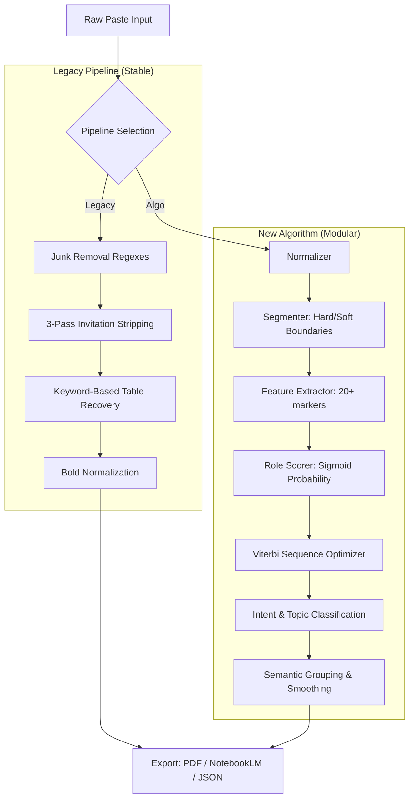

# 📊 Gemini PDF Tool — Hyper-Detailed Technical Manual

The **Gemini PDF Tool** is a high-performance React 19 application built to handle the structural complexities of LLM conversation logs. It utilizes a dual-engine architecture to ensure clean, professional, and accessible documentation.

## 🏗️ System Architecture & Data Flow

The application processes raw text through two distinct pathways. The "New Algorithm" represents a forward-looking, learning-based approach, while the "Legacy" engine provides robust, rule-based stability.

### 🔄 Multi-Stage Pipeline (Mermaid)

---

## 🔬 Granular Algorithm Breakdown

### 1. Segmentation Strategy (`segmenter.ts`)
The tool doesn't just split on blank lines; it uses a hierarchy of boundaries:
- **Hard Boundaries**: Explicit headers (e.g., `Gemini の回答`), horizontal rules (`---`), and double-newlines.
- **Soft Boundaries**: Contextual triggers like a line ending in `?` followed by a long block, or standalone CLI commands (`npm`, `git`).
- **Over-segmentation Fix**: A post-pass merge rule combines short "rapid-fire" questions and continues blocks if a sentence ends on a Japanese particle (like `の` or `に`).

### 2. Role Scoring & Local Learning (`roleScorer.ts`)
Each block receives a probability score using a weight-based system:
- **Sigmoid Mapping**: Transforms raw feature weights into a `0.0 ~ 1.0` probability.
- **Deltas & Weights**: Features like `hasTable` or `hasMarkdownHeading` strongly favor the AI role, while `hasQuestion` or `shortText` favor the User.
- **Local Learning (correctionStore)**: Every time you manually toggle a role in the UI, the app records the correction. The `weightUpdater.ts` then generates deltas to adjust the importance of features for future pastes *within your local session*.

### 3. Intent & Topic Engine
- **Intent Classifier**: Maps text to tags like `ERROR`, `CONFIRM`, `CMD`, `PLAN`, or `META`. This allows the UI to show helpful tags like "[CMD]" next to technical requests.
- **Semantic Grouping**: Measures the **Jaccard Similarity** of adjacent blocks. If two blocks share enough keywords/topics (threshold `0.08`), they are visually grouped together in the analysis view.

---

## 🎨 Design System & Core Aesthetics

The interface is built with **Tailwind CSS v4** and follows a cohesive "Gemini-inspired" design language defined in `index.css`.

### 🧩 Visual Tokens
- **Typography**: Uses `Inter` for English and `Noto Sans JP` for Japanese, with specific font-feature settings (`cv02`, `cv03`) for high legibility.
- **Color Palette**:
    - **Primary**: Indigo/Indigo (`#6366f1`, `#4f46e5`).
    - **Background**: Linear gradients (`#f0f2f5` to `#e8eaef`) for a premium paper feel.
    - **Cards**: Glassmorphism effects with subtle shadows (`var(--shadow-lg)`) and indigo top-accents for AI responses.
- **Print Optimization**: Uses `print-color-adjust: exact` and specific `@media print` rules to ensure that table stripes and background gradients are preserved in the PDF output.

---

## 🧹 Junk Removal: The Regex Shield

To maintain a "clean" document, the app utilizes highly specific regex patterns:
- **Inline Junk**: Removes YouTube "X views" snippets, source citations `[cite:n]`, and web-search stubs (`Searched 5 sites`).
- **Trailing Invitation Removal**: A 3-pass scan that aggressively seeks out AI-generated filler such as *"Would you like me to explain more?"* or *"Is there anything else?"* across line, paragraph, and sentence levels.

## 🏁 Feature Status Matrix

The following table provides a definitive status of every major feature implemented in the application as of **2026-02-21**.

### ✅ Fully Operational
| Feature | Status | Technical Detail |
| :--- | :--- | :--- |
| **Chat Parsing** | 🟢 Working | Reliable detection of `USER` / `GEMINI` / `CLAUDE` markers. |
| **Junk Removal** | 🟢 Working | Removes "Copy", "Share", "Drafts" and other browser UI artifacts. |
| **Invitation Stripping** | 🟢 Working | 3-pass recursive removal of trailing AI conversation lures. |
| **Table Recovery** | 🟢 Working | Converts plaintext/broken tables into structured HTML. |
| **Key Points** | 🟢 Working | extracts 1-3 highlights from every AI response by priority. |
| **Bold Normalizing** | 🟢 Working | Fixes invalid Markdown bold tags (internal spaces) via CSS/RegExp. |
| **TOC Indeling** | 🟢 Working | Dynamic Table of Contents with [表あり] badges for tables. |
| **PDF Generation** | 🟢 Working | A4 high-res export via `html2pdf.js` with resolv-scaling. |
| **MD for NotebookLM** | 🟢 Working | Clean Markdown export with optimized table "reversal". |
| **Algo Pipeline** | 🟢 Working | Modular Phase 1 (Role Scorer) and Phase 2 (Grouping) logic. |
| **Local Learning** | 🟢 Working | Saves manual role corrections to adjust algorithm weights. |

### ⚠️ Known Limitations & Not-Working
| Feature | Status | Content / Cause |
| :--- | :--- | :--- |
| **PDF Folding** | 🟠 Limited | If a message is "collapsed" in the UI, it remains collapsed in the PDF. |
| **Mobile Layout** | 🔴 Not Working | Sidebar/Split-pane view breaks on screens narrower than 768px. |
| **Algo accuracy** | 🟠 Limited | ~48.5% success on technical logs without any clear markers. |
| **Interactive PDFs** | 🔴 Not Working | Jump-links (TOC) and Collapse buttons are static in the PDF. |
| **Long Tables** | 🟠 Limited | Long tables may occasionally split poorly across PDF page breaks. |
| **Undo Clear** | 🔴 Not Working | Clicking the "Clear" button is permanent; no local undo stack. |
| **External Images** | 🟠 Limited | Images from external CDNs/URLs may fail to print due to CORS. |

---

## 📥 Professional Export Configuration

### 💎 High-Resolution PDF
- **resolution**: Hardcoded `scale: 2` using `html2canvas` for crisp text on high-DPI displays.
- **JS-PDF**: Standard A4 portrait mode with precise 15mm margins on all sides.
- **ErrorBoundary protection**: React UI components are wrapped in boundaries; if a single complex table fails to render, the rest of the document survives, preventing "White Screen of Death" during export.

### 📓 NotebookLM "Reverse" Export
Unlike the PDF (which focuses on visual beauty), the NotebookLM export focuses on **semantic data continuity**. It intentionally reverses HTML transforms, converting `<table>` tags back into **GFM Pipe Tables** so that NotebookLM can correctly parse the structure for its internal "Grounding" engine.

### 📂 Analysis JSON
For developers, the "Algo" mode allows exporting a full JSON dump of the conversation, including every extracted feature, confidence score, and semantic vector.
