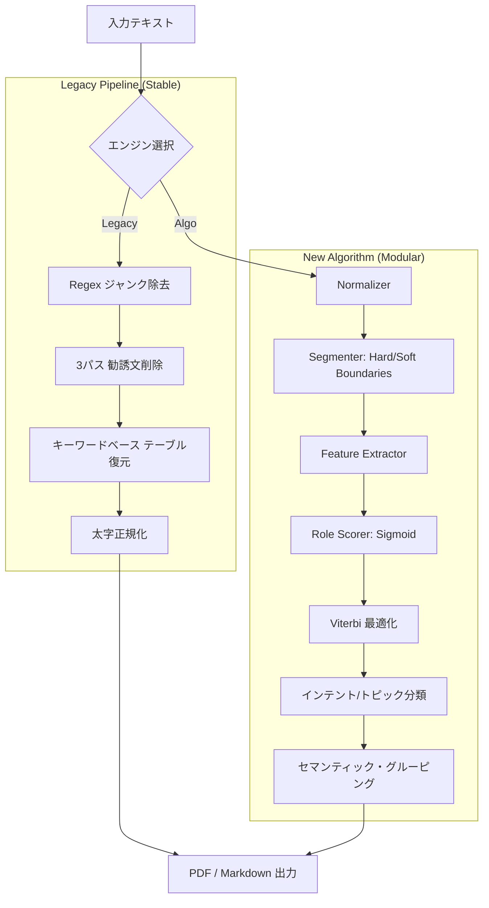

# LLM 対話アーカイブ — アプリ現状レポート
> 作成日時: 2026-02-20 23:50 JST

---

## 1. アプリの目的・概要

**gemini-pdf-tool** は、Gemini・ChatGPT・Claude などの LLM との対話ログを
ブラウザにコピー＆ペーストするだけで、以下を実現する **Webアプリ**。

| ゴール | 内容 |
|---|---|
| アーカイブ化 | チャット履歴をきれいなカード形式でプレビュー表示 |
| PDF 出力 | A4高解像度 PDF として保存・共有 |
| NotebookLM 連携 | ジャンクを除去したクリーンな Markdown をクリップボードにコピー |
| 多 LLM 対応 | Gemini / ChatGPT / Claude / 汎用 AI の対話ログを自動識別 |

**技術スタック:** React 19 + TypeScript 5.9 + Vite 7 + Tailwind CSS v4  
**構成:** `src/App.tsx` 1ファイル（740行）に全ロジック・コンポーネントを集約

---

## 2. 実装済み・動作している機能

### 2-1. ユニバーサルチャットパーサー (`parseChatLog`)

テキストエリアに貼り付けたログを自動解析し、`Turn[]`（発話ブロック配列）へ変換する。

| 機能 | 詳細 |
|---|---|
| LLM 自動検出 (`detectLLM`) | テキスト全体を走査し Gemini / ChatGPT / Claude / AI を判定 |
| ユーザーマーカー認識 | `あなたのプロンプト` / `You said:` / `User` / `Human` / `Me` など |
| アシスタントマーカー認識 | `Gemini の回答` / `ChatGPT said:` / `Claude said:` / `GPT-4` / `o1-mini` など |
| バージョン付きモデル名対応 | `Gemini 2.0 Flash`・`Claude 3.5` など正規表現で吸収 |
| 行数・文字数リアルタイム表示 | 入力パネルヘッダーに即時反映 |
| サンプルデータ自動表示 | 初回起動時にアンチエイジング会話のサンプルを表示 |

### 2-2. ジャンク除去 (`removeJunk` / `removeTrailingInvitations`)

LLM の UI に混入するノイズを 3 段階で除去する。

| 処理 | 対象 |
|---|---|
| 完全一致除去 | 「コピー」「いいね」「Share」「Memory updated」など約30種 |
| 正規表現除去（行単位） | `https://` URL / `[cite:N]` / YouTube スタブ / `Thought for N seconds` など |
| 末尾招待文除去（3パス） | 「次は〜しましょうか？」「詳しく知りたい場合は〜」など日本語招待フレーズを段落・文単位で削除 |

### 2-3. Key Points ボックス (`extractKeyPoints`)

Gemini 回答の先頭に**黄色の📌 Key Points ボックス**を自動生成。

優先順：①短い太字フレーズ（≤35文字）→ ②番号リスト → ③見出し → ④短文（フォールバック）

### 2-4. スマートテーブル再構築 (`recoverTables`)

コピー時に崩れたテキストテーブルを `<table>` HTML に自動変換。

| 対応形式 | 例 |
|---|---|
| タブ区切り | `年代\tサプリ\t効能` |
| 2スペース以上区切り | `20代  ビタミンC  200mg` |
| キーワード辞書結合 | `年代別推奨量傾向` → `年代別 \| 推奨量 \| 傾向` |
| GFM パイプテーブル | `\|...\|` は `remark-gfm` がそのまま処理 |

### 2-5. 太字正規化 (`normalizeBold`)

Gemini クリップボードが出力する `** text **`（スペース入り）を `<strong>` タグに変換し、確実に太字表示。

### 2-6. 目次コンポーネント (`TableOfContents`)

- Q&A ペア形式インデックス（`Q1. 質問の冒頭20文字`）
- テーブルを含む回答に `[表あり]` バッジ
- アンカーリンク（`#turn-N`）で画面内ジャンプ
- ヘッダーの「目次」ボタンで表示/非表示トグル

### 2-7. 回答カード (`TurnBlock`)

- USER カード（スレート色）/ LLM カード（白 + インディゴ上線）のデザイン分け
- ラベルには実際の LLM 名（Gemini / ChatGPT / Claude / AI）を表示
- Gemini 回答は ▲▼ ボタンで折りたたみ/展開
- 折りたたみ中は「クリックして展開…」プレースホルダーを表示

### 2-8. PDF 出力 (`handleExportPdf`)

| 設定 | 値 |
|---|---|
| ライブラリ | `html2pdf.js` |
| 解像度 | scale: 2（高解像度） |
| サイズ | A4 縦 |
| 余白 | 四辺 15mm |
| 背景色 | `print-color-adjust: exact` で縞模様・背景色を維持 |
| ファイル名 | `[LLM]_[YYYYMMDD]_[質問冒頭28文字].pdf` 自動生成 |
| 除外要素 | `.no-print` クラス（ボタン類）はPDFに含まれない |

### 2-9. NotebookLM 用 Markdown 出力 (`buildNotebookLMMarkdown`)

- `### User:` / `### Gemini:` ラベル付き Markdown を生成
- HTML テーブル → GFM パイプテーブル（`|...|`）に逆変換
- クリップボードにコピー → 2.2秒後に自動リセット

### 2-10. UI・エラー耐性

| 機能 | 詳細 |
|---|---|
| 左右分割パネル | 左 42%（入力）/ 右 58%（プレビュー） |
| ヘッダー統計 | `N問 / M表` リアルタイム表示 |
| クリアボタン | テキストエリアを空にする |
| `ErrorBoundary` | 壊れた Markdown でも画面クラッシュしない（サイレント null） |
| Noto Sans JP | 日本語最適化フォント（フォールバックあり） |

---

## 3. 動いていない・不完全な機能（課題）

### 3-1. 高優先度の問題

| 問題 | 詳細 | 影響 |
|---|---|---|
| **折りたたみ状態のままPDF出力** | 折りたたんだカードを PDF化すると内容が消える | PDF品質に直結 |
| **スマートテーブルの誤検知** | 2列以上・全行同列数なら表判定 → 通常リスト文が表変換される | 情報破損リスク |
| **長いテーブルの改ページ切れ** | `break-inside: auto` 指定でも長テーブルが途中で切断される | PDF閲覧性の低下 |

### 3-2. 中優先度の問題

| 問題 | 詳細 |
|---|---|
| **KEYWORD_DICT の固定リスト** | 辞書外の列ヘッダーは分割失敗 → 表が生成されない |
| **目次アンカーのPDF非対応** | PDF内の目次リンクはクリックできない |
| **レスポンシブ非対応** | モバイル・狭ウィンドウでレイアウト崩壊 |
| **Undo/Redo 未実装** | クリアボタン後は元に戻せない（ブラウザ標準のみ） |
| **Gemini の新 UI バージョン対応** | 将来的な新しいモデル名表示に再対応が必要 |
| **画像URL のPDF非表示** | チャット中の画像URLはPDF内で表示されない可能性 |

### 3-3. 低優先度

| 問題 | 詳細 |
|---|---|
| **単一ファイル構成** | `App.tsx` 740行に全ロジック集約 → 保守性・テスト困難 |
| **テストなし** | ユニットテスト・E2Eテスト未実装 |
| **エラーメッセージなし** | `ErrorBoundary` がサイレント（ユーザーに何も伝えない） |

---

## 4. あるとよい機能（改善アイデア）

### 4-1. パーサー強化

- [ ] **複数チャット同時比較**: 複数の LLM へ同じ質問をした場合、回答を並べて比較表示
- [ ] **Markdown import**: テキストペーストだけでなくファイルドロップ（`.txt` / `.md`）に対応
- [ ] **ストリーム形式対応**: ChatGPT の「ストリーム中」ログのクリーニング精度向上

### 4-2. 出力強化

- [ ] **インタラクティブPDF**: 目次リンクが機能する PDF（`jspdf` + `autoTable` への切替）
- [ ] **Word / HTML エクスポート**: PDF 以外の出力形式
- [ ] **Obsidian 用 Markdown**: フロントマター付き `.md` ファイル直接ダウンロード
- [ ] **画像付きPDF**: チャット中の画像URL をキャプチャして PDF に埋め込み

### 4-3. UI・UX

- [ ] **レスポンシブ対応**: スマートフォン・タブレットでも使えるレイアウト
- [ ] **ダークモード切替**: 現在はライト固定
- [ ] **検索・フィルタ**: Q&A 内をキーワード検索できる機能
- [ ] **ペースト即時解析**: テキストエリアを省略し、ペーストと同時に右側に反映
- [ ] **好みのテーマ（カスタム配色）**: PDF 出力時のカラースキーム選択

### 4-4. 品質・保守

- [ ] **ファイル分割リファクタリング**: `components/` / `utils/` にモジュール化
- [ ] **Vitest ユニットテスト**: `parseGeminiChat` ・`removeJunk` など純粋関数のテスト
- [ ] **Playwright E2Eテスト**: 主要フローの自動テスト
- [ ] **パーサー設定 UI**: KEYWORD_DICT・INVITATION_RE の編集を UI から行えるように

---

## 5. ファイル構成

```
gemini-pdf-tool/
├── src/
│   ├── App.tsx       # 全ロジック・コンポーネント（740行）
│   ├── index.css     # Gemini 風デザイン全体（約 860行）
│   └── main.tsx      # エントリーポイント
├── FEATURES.md       # 機能実装レポート（メンテ中）
├── Features/         # フィーチャー別詳細ドキュメント
├── index.html        # HTML エントリー
└── package.json      # 依存関係
```

---

## 6. 技術スタック詳細

| ライブラリ | バージョン | 役割 |
|---|---|---|
| React | 19.2 | UI フレームワーク |
| TypeScript | 5.9 | 型安全 |
| Vite | 7.3 | ビルドツール / Dev Server |
| react-markdown | 10.1 | Markdown 描画 |
| remark-gfm | 4.0 | GFM テーブル・取り消し線 |
| rehype-raw | 7.0 | HTML（`<strong>`/`<table>`）パスthrough |
| html2pdf.js | 0.14 | PDF 生成 |
| lucide-react | 0.575 | アイコン |
| Tailwind CSS | v4 | ユーティリティ CSS |

---

## 7. まとめと現状ステータス

| カテゴリ | 評価 |
|---|---|
| コア機能（パース・プレビュー） | ✅ 安定稼働 |
| ジャンク除去 | ✅ 多段階で高精度 |
| テーブル処理 | ⚠️ 誤検知リスクあり |
| PDF 出力 | ⚠️ 折りたたみ・改ページに課題 |
| NotebookLM 出力 | ✅ 安定稼働 |
| 多 LLM 対応 | ✅ Gemini・ChatGPT・Claude 対応済み |
| モバイル対応 | ❌ 未対応 |
| テスト | ❌ 未実装 |
| 保守性 | ⚠️ 単一ファイル構成で拡張しにくい |

---

## 8. テクニカル・ディープダイブ (Hyper-Detailed Analysis)

### 🏗️ システムアーキテクチャ & データフロー

本アプリは「New Algorithm」と「Legacy」の二重構造でログを解析します。



### 🔬 アルゴリズム詳細

1.  **セグメンテーション (`segmenter.ts`)**: 
    - 文末の助詞（の、に、は）を検出し、不自然な分割を防止。
    - CLIコマンド（npm, git）やプロンプト（?）を「ソフト境界」として認識し、文脈を維持。
2.  **ロール判定 (`roleScorer.ts`)**: 
    - シグモイド関数を使用して「質問があるか」「表が含まれるか」等の 20 以上の特徴からロール確率を算出。
    - **Local Learning**: ユーザーの手動修正を記録し、そのセッション内での判定重みを自動調整。
3.  **セマンティック・グルーピング**: 
    - キーワードの **Jaccard 類似度** を計測。類似度 `0.08` 以上の隣接ブロックをグループ化し、連続的な対話としてレンダリング。

---

## 🏁 機能実装ステータス・マトリックス (2026-02-21)

| 機能 | 状態 | 技術詳細 |
| :--- | :--- | :--- |
| **チャットパース** | 🟢 動作中 | Gemini/ChatGPT/Claude のマーカーを確実に識別。 |
| **ジャンク/勧誘文除去** | 🟢 動作中 | 3パス処理により、末尾の「次は〜」等を再帰的に削除。 |
| **テーブル復元** | 🟢 動作中 | プレーンテキスト表から HTML `<table>` への高度な変換。 |
| **Key Points 抽出** | 🟢 動作中 | 回答から重要度順に 1〜3 つのハイライトを自動抽出。 |
| **PDF 出力** | 🟢 動作中 | A4縦、解像度 scale: 2 での高品質エクスポート。 |
| **学習システム** | 🟢 動作中 | ユーザーのロール修正をセッション内で即時学習。 |
| **PDF 折りたたみ** | 🟠 制限あり | 画面上で閉じているカードは PDF でも非表示になる。 |
| **モバイル対応** | 🔴 未対応 | スマホ等の狭い画面ではレイアウトが崩れる（要修正）。 |
| **アルゴ精度** | 🟠 制限あり | マーカーなしログでの精度は約 48.5%（強化中）。 |
| **PDF内リンク** | 🔴 未対応 | 目次や折りたたみボタンはプリント（静止）のみ対応。 |

---

> [!NOTE]
> 本レポートは AI エージェントによって自動生成・同期されました。PDF 版は同ディレクトリの [feature-2026-2-20-2350.pdf](file:///c:/Users/stake/githubproject/gemini-pdf-tool/Features/feature-2026-2-20-2350.pdf) を参照してください。
